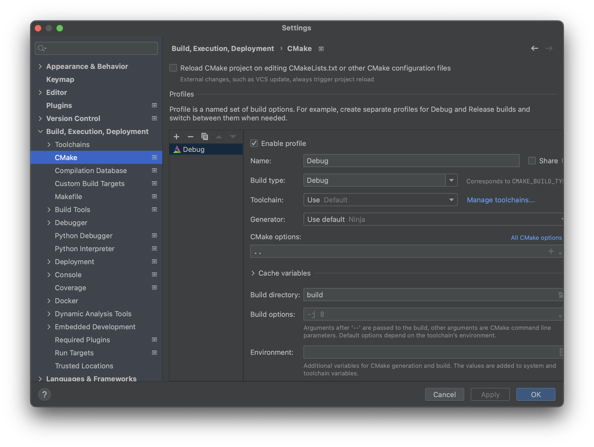
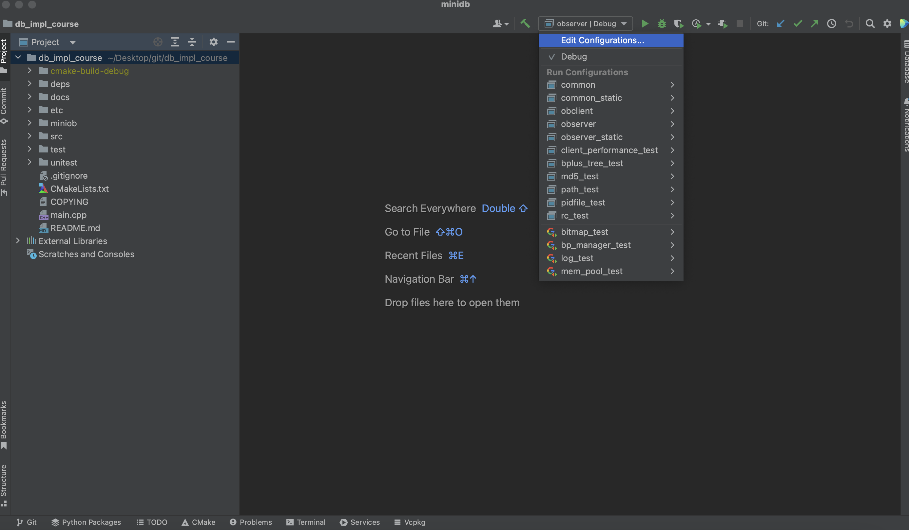
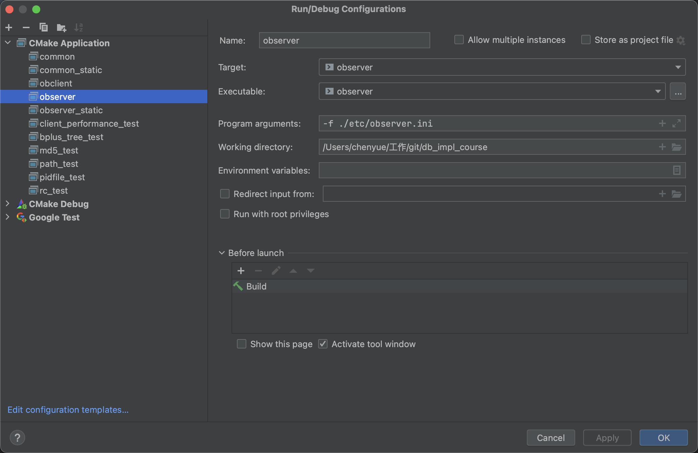

# Clion调试

##### 配置CMake

- Build directory是CMake的编译目录

- CMake options是CMake的命令参数

  CMake options填 ".." 表示要在子目录build中编译整个项目

配置完成后出现configurations

##### 配置observer运行参数

就可以执行observer和obclient并且在代码处打断点调试了。